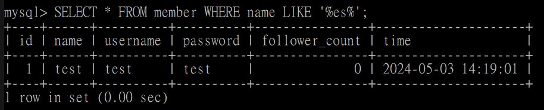
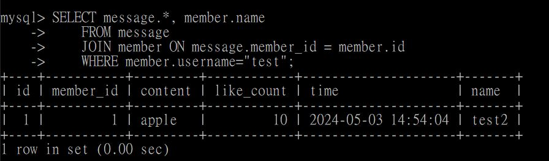

# Week5 <br>
## TASK 2

1.
    ```SQL
    CREATE DATABASE website;
    ```
    </img>

2.
    ```SQL
    USE website;
    CREATE TABLE member(
        `id` BIGINT PRIMARY KEY AUTO_INCREMENT, 
        `name` VARCHAR(255) NOT NULL, 
        `username` VARCHAR(255) NOT NULL,
        `password` VARCHAR(255) NOT NULL,
        `follower_count` INT UNSIGNED NOT NULL DEFAULT 0,
        `time` DATETIME NOT NULL DEFAULT CURRENT_TIMESTAMP
    );
    DESCRIBE member;
    ```
    </img>

## TASK 3
1.
    ```SQL
    INSERT INTO member(`name`,`username`,`password`,`follower_count`) VALUES("test","test","test", 0);
    INSERT INTO member(`name`,`username`,`password`,`follower_count`) VALUES("shawn","user1","11111", 100); 
    INSERT INTO member(`name`,`username`,`password`,`follower_count`) VALUES("john","user2","22222", 200);
    INSERT INTO member(`name`,`username`,`password`,`follower_count`) VALUES("ryan","user3","33333", 300);
    INSERT INTO member(`name`,`username`,`password`,`follower_count`) VALUES("mary","user4","44444", 400);
    ```
    </img>

2.
    ```SQL
    SELECT * FROM member;
    ```
    </img>

3.
    ```SQL
    SELECT * FROM member ORDER BY time DESC; 
    ```
    </img>

4.
    ```SQL
    SELECT * FROM member ORDER BY time DESC LIMIT 1,3;
    ```
    </img>

5.
    ```SQL
    SELECT * FROM member WHERE username = 'test';
    ```
    </img>

6.
    ```SQL
    SELECT * FROM member WHERE name LIKE '%es%';
    ```
    </img>

7.
    ```SQL
    SELECT * FROM member WHERE username = 'test' AND password = 'test';
    ```
    </img>

8.
    ```SQL
    UPDATE member SET name = 'test2' WHERE username = 'test';
    ```
    </img>

## TASK 4
1.
    ```SQL
    SELECT COUNT(*) FROM member;
    ```
    </img>

2.
    ```SQL
    SELECT SUM(follower_count) FROM member;
    ```
    </img>

3.
    ```SQL
    SELECT AVG(follower_count) FROM member;
    ```
    </img>

4.
    ```SQL
    SELECT AVG(follower_count)
    FROM (
        SELECT follower_count
        FROM member
        ORDER BY follower_count DESC
        LIMIT 2
    ) AS subquery;
    ```
    </img>

## TASK 5
1.
    ```SQL
    CREATE TABLE message(
    id BIGINT PRIMARY KEY AUTO_INCREMENT,
    member_id BIGINT NOT NULL,
    content VARCHAR(255) NOT NULL,
    like_count INT UNSIGNED NOT NULL  DEFAULT 0,
    time TIMESTAMP NOT NULL DEFAULT CURRENT_TIMESTAMP,
    FOREIGN KEY (member_id) REFERENCES member(id)
    );
    DESCRIBE message;
    ```
    </img>

-
    ```SQL
    INSERT INTO message(member_id, content, like_count)VALUES(1,"apple",10);
    INSERT INTO message(member_id, content, like_count)VALUES(2,"banana",20);
    INSERT INTO message(member_id, content, like_count)VALUES(3,"cherry",30);
    INSERT INTO message(member_id, content, like_count)VALUES(4,"yoyoman",40);
    INSERT INTO message(member_id, content, like_count)VALUES(5,"mini",50);
    SELECT * FROM message;
    ```
    </img>

2.
    ```SQL
    SELECT message.*, member.name
    FROM message JOIN member ON message.member_id=member.id ;
    ```
    </img>

3.
    ```SQL
    SELECT message.*, member.name
    FROM message 
    JOIN member ON message.member_id = member.id
    WHERE member.username="test";
    ```
    </img>

4.
    ```SQL
    SELECT member.username,AVG(message.like_count)
    FROM message
    JOIN member ON message.member_id = member.id
    WHERE member.username = "test";
    ```
    </img>

5.
    ```SQL
    SELECT member.username,AVG(message.like_count)
    FROM message
    JOIN member ON message.member_id =member.id
    GROUP BY member.username;
    ```
    </img>
